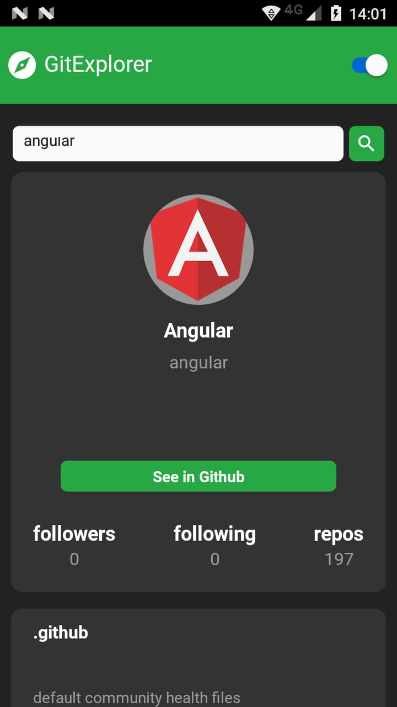

# GitExplorer


[](#)
[](https://github.com/mariana-pereira/git-explorer-mobile/stargazers)
[](https://github.com/mariana-pereira/git-explorer-mobile/network/members)
[](https://github.com/mariana-pereira/git-explorer-mobile/graphs/contributors)

> Explore the repositories of a Github user

<p align="center">
   
   
   
</p>

---

# Techs


- [React Native](https://reactnative.dev/)
- [Typescript](https://www.typescriptlang.org/)
- [Redux](https://redux.js.org/)
- [styled-components](https://styled-components.com/)
- [GitHub REST API](https://docs.github.com/en/rest)

# Installation

**You need to install [Node.js](https://nodejs.org/en/download/), [Yarn](https://yarnpkg.com/), [Android SDK](https://developer.android.com/studio/?gclid=Cj0KCQjw-O35BRDVARIsAJU5mQV6QZXakbDx6ceX5Erq2Kl5XaEtQViwuwF2d3QzlsvVrBmprPgI71oaAooFEALw_wcB&gclsrc=aw.ds) first, in order to clone the project via HTTPS, run this command:**

```git clone https://github.com/mariana-pereira/git-explorer-mobile.git```

SSH URLs provide access to a Git repository via SSH, a secure protocol. If you have a SSH key registered in your Github account, clone the project using this command:

```git clone git@github.com:mariana-pereira/git-explorer-mobile.git```

**Install dependencies**

```yarn install```

# Getting Started

Run the following command in order to start the application in a development environment:

```
  // Install the application in a android device
  react-native run-android

  // Start the application
  yarn start
```

# Show your support

Give a ⭐️ if this project helped you!

Made with love by [Mariana Pereira](https://github.com/mariana-pereira) :heart:
